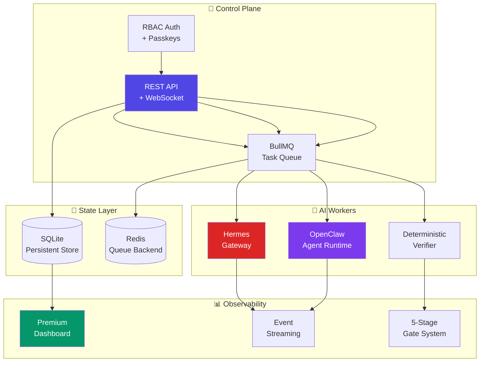
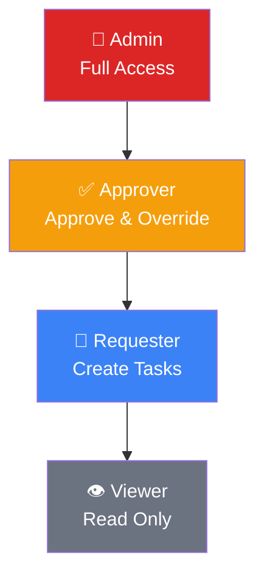
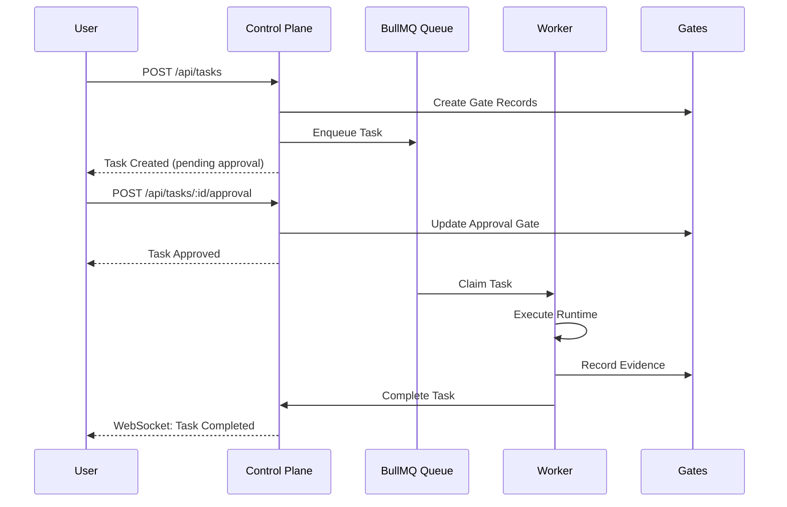

<div align="center">

#  Ultimate System

### *Enterprise-Grade AI Orchestration Platform*

**A production-ready, autonomous task execution framework with real-time dashboards, RBAC security, and AI-powered revenue generation.**

[](https://www.typescriptlang.org/)
[](https://nodejs.org/)
[](LICENSE)
[](https://github.com)
[](https://codecov.io)

</div>

---

<div align="center">

### ✨ *Where AI Agents Meet Enterprise Governance* ✨

</div>


<!-- Premium Divider -->
<div align="center">

</div>

##  Overview

Ultimate System is a **FAANG-grade** enterprise orchestration platform that transforms how organizations deploy, manage, and scale AI-powered workflows. Built with precision engineering and zero-compromise security, it delivers:



<table>
<tr>
<td width="50%" valign="top">

### 🏗️ **Architecture Pillars**

- **Real-Time Dashboard** — Obsidian glass UI with live telemetry
- **RBAC Security** — Role-based access with WebAuthn passkeys
- **Queue-Driven Workers** — BullMQ + Redis for reliability
- **5-Stage Gates** — Product → Engineering → QA → Security → Release
- **AI Integration Layer** — Hermes + OpenClaw + Paperclip sync
- **Autonomous Revenue** — Self-generating business opportunities

</td>
<td width="50%" valign="top">

### ⚡ **Performance Profile**

| Metric | Value |
|--------|-------|
| Task Creation | < 50ms |
| Queue Dispatch | < 10ms |
| Gate Validation | < 5ms |
| WebSocket Latency | < 20ms |
| Worker Heartbeat | 3s interval |
| Memory Footprint | ~150MB |

</td>
</tr>
</table>

<!-- Premium Divider -->
<div align="center">

</div>

##  Quick Start

### Prerequisites

<table>
<tr>
<td>

```bash
# Required
Node.js 22+
pnpm 10+
Python 3.11 + uv
Docker (for sandboxed verification)
Redis (or use Docker fallback)
```

</td>
</tr>
</table>

### 🚀 One-Command Setup

```bash
# Clone and bootstrap
git clone https://github.com/your-org/ultimate-system.git
cd ultimate-system
./scripts/setup.sh && ./scripts/dev.sh
```

<div align="center">

**Then open** [`http://localhost:8888`](http://localhost:8888) **in your browser**

</div>

<table>
<tr>
<td width="33%" align="center">

<br/><strong>Unified Access</strong>
<br/><sub>Dashboard + API on port 8888</sub>
</td>
<td width="33%" align="center">

<br/><strong>Passkey Auth</strong>
<br/><sub>WebAuthn biometric login</sub>
</td>
<td width="33%" align="center">

<br/><strong>AI-Powered</strong>
<br/><sub>Autonomous task execution</sub>
</td>
</tr>
</table>

<!-- Premium Divider -->
<div align="center">

</div>

##  Dashboard Preview

<div align="center">

### 🌌 Ultra-Premium Obsidian Glass Interface


</div>

<table>
<tr>
<td width="25%" align="center">
<br/>
<sub>Live telemetry feed</sub>
</td>
<td width="25%" align="center">
<br/>
<sub>Pipeline visualization</sub>
</td>
<td width="25%" align="center">
<br/>
<sub>Context-aware assistant</sub>
</td>
<td width="25%" align="center">
<br/>
<sub>Autonomous income streams</sub>
</td>
</tr>
</table>

<!-- Premium Divider -->
<div align="center">

</div>

##  System Knowledge Graph

```text
┌─────────────────────────────────────────────────────────────────────────────┐
│                              ORG                                             │
│  ┌───────────────────────────────────────────────────────────────────────┐  │
│  │                            TEAM[]                                      │  │
│  │  ┌─────────────────────────────────────────────────────────────┐      │  │
│  │  │                      WORKER[]                                 │      │  │
│  │  │  ├── WorkerSession[] ───────────────────────────────────┐  │      │  │
│  │  │  ├── MemoryEntry[]                                      │  │      │  │
│  │  │  └── BullMQ: ultimate-system.tasks.{workerId}           │  │      │  │
│  │  └─────────────────────────────────────────────────────────────┘      │  │
│  └───────────────────────────────────────────────────────────────────────┘  │
│                                                                              │
│  ┌───────────────────────────────────────────────────────────────────────┐  │
│  │                            TASK[]                                      │  │
│  │  ├── GateRecord[product, engineering, qa, security, release]         │  │
│  │  ├── TaskEvent[]                                                       │  │
│  │  ├── ExecutionRecord[]                                                 │  │
│  │  ├── TaskArtifacts                                                     │  │
│  │  ├── ReleaseDecision                                                  │  │
│  │  └── TaskIntegrationRefs                                               │  │
│  │      ├── PaperclipTaskRef ──► Company/Goal/Issue Sync                  │  │
│  │      ├── HermesTaskRef ─────► Gateway Model Execution                  │  │
│  │      └── OpenClawTaskRef ────► Agent Skills & Tools                    │  │
│  └───────────────────────────────────────────────────────────────────────┘  │
└─────────────────────────────────────────────────────────────────────────────┘
```

### Entity Relationships

| Entity | Meaning | Storage |
|--------|---------|---------|
| `Org` | Budget & mission boundary | SQLite |
| `Team` | Delivery scope | SQLite |
| `WorkerRecord` | Runtime identity with capabilities | SQLite |
| `TaskRecord` | Work request + routing state | SQLite |
| `GateRecord` | Workflow stage evidence | SQLite |
| `ExecutionRecord` | Auditable transcript | SQLite |
| `TaskIntegrationRefs` | Upstream sync references | SQLite |

<!-- Premium Divider -->
<div align="center">

</div>

##  Revenue Orchestrator

<div align="center">

### 🤖 Autonomous Income Generation


</div>

The Revenue Orchestrator continuously discovers and executes business opportunities across four streams:

| Stream | Source | Action |
|--------|--------|--------|
| 🔍 **Lead Generation** | Brave Search API | Find companies hiring for AI/automation |
| 📄 **Document Processing** | ClearDesk API | Process invoices, contracts, receipts |
| 📊 **Market Research** | Trend Analysis | Analyze opportunities for content/products |
| 📧 **Sales Outreach** | HubSpot CRM | Follow up with high-value contacts |

```typescript
// Configuration via environment
REVENUE_AUTO_START=true
REVENUE_MAX_DAILY_TASKS=100
APEX_MCP_ENDPOINT=http://localhost:4000
MONEY_ENDPOINT=http://localhost:8000
CLEARDESK_ENDPOINT=https://clear-desk-ten.vercel.app
```

<details>
<summary><b>📊 Revenue API Endpoints</b></summary>

| Method | Path | Auth | Description |
|--------|------|------|-------------|
| `GET` | `/api/revenue/status` | User | Get orchestrator statistics |
| `GET` | `/api/revenue/health` | User | Check service connectivity |
| `POST` | `/api/revenue/start` | Approver | Start autonomous generation |
| `POST` | `/api/revenue/stop` | Approver | Stop orchestrator |

</details>

<!-- Premium Divider -->
<div align="center">

</div>

##  Security Model

### 🔐 RBAC Role Hierarchy



| Role | Read | Create | Approve | Override Gates | Manage Users |
|------|:----:|:------:|:-------:|:--------------:|:------------:|
| `viewer` | ✅ | ❌ | ❌ | ❌ | ❌ |
| `requester` | ✅ | ✅ | ❌ | ❌ | ❌ |
| `approver` | ✅ | ✅ | ✅ | ✅ | ❌ |
| `admin` | ✅ | ✅ | ✅ | ✅ | ✅ |

### 🛡️ Passkey Authentication

```typescript
// WebAuthn configuration
AUTH_RP_NAME=Ultimate System
AUTH_RP_IDS=localhost
AUTH_ORIGINS=http://localhost:4173,http://localhost:8888
```

- ✅ Biometric authentication (Face ID, Touch ID, Windows Hello)
- ✅ Hardware security keys (YubiKey, Titan)
- ✅ No password storage required
- ✅ Phishing-resistant

<!-- Premium Divider -->
<div align="center">

</div>

##  Repository Map

```
📦 ultimate-system
├── 📂 apps/
│   ├── 🎨 web/                  # Vite/React Premium Dashboard
│   ├── ⚙️  control-plane/       # Express API + Auth + Queue Producer
│   ├── 🔧 worker/               # BullMQ Consumer + Runtime Adapters
│   ├── 🖥️  cli/                 # Terminal User Interface (TUI)
│   └── 🌐 unified/              # Single-Port Server (Dashboard + API)
│
├── 📂 packages/
│   ├── 📜 contracts/           # Zod Schemas + Domain Types
│   ├── 🧠 core/                # Services, Policies, Gate Logic
│   └── 💾 sqlite-store/        # Persistence Layer
│
├── 📂 docs/
│   ├── 📖 USER_MANUAL.md       # Executive Guide
│   ├── 🏗️  ARCHITECTURE.md     # System Design
│   └── 🔒 SECURITY_MODEL.md    # Threat Model
│
├── 📂 scripts/
│   ├── 🚀 setup.sh            # Bootstrap Environment
│   ├── ⚡ dev.sh               # Development Server
│   └── ✅ test.sh              # Validation Suite
│
└── 📂 tests/
    └── 🧪 e2e/                  # End-to-End Verification
```

<!-- Premium Divider -->
<div align="center">

</div>

##  API Reference

### Authentication

```bash
# Login with credentials
curl -X POST http://localhost:4100/api/auth/login \
  -H "Content-Type: application/json" \
  -d '{"email":"admin@ultimate-system.local","password":"change-this-password"}'

# Response: Set-Cookie header with session
```

### Task Lifecycle



<details>
<summary><b>📋 Complete API Endpoints</b></summary>

#### Health & State
| Method | Path | Description |
|--------|------|-------------|
| `GET` | `/api/health` | System health check |
| `GET` | `/api/state` | Full dashboard state |

#### Authentication
| Method | Path | Description |
|--------|------|-------------|
| `POST` | `/api/auth/login` | Password login |
| `POST` | `/api/auth/logout` | End session |
| `GET` | `/api/auth/session` | Current session |
| `POST` | `/api/auth/passkeys/login/options` | Passkey options |
| `POST` | `/api/auth/passkeys/login/verify` | Passkey verify |
| `POST` | `/api/auth/passkeys/register/options` | Register options |
| `POST` | `/api/auth/passkeys/register/verify` | Register verify |
| `GET` | `/api/auth/passkeys` | List passkeys |
| `DELETE` | `/api/auth/passkeys/:id` | Remove passkey |

#### Tasks
| Method | Path | Description |
|--------|------|-------------|
| `GET` | `/api/tasks` | List tasks |
| `POST` | `/api/tasks` | Create task |
| `GET` | `/api/tasks/:id` | Get task |
| `GET` | `/api/tasks/:id/detail` | Full task detail |
| `GET` | `/api/tasks/:id/events` | Task events |
| `GET` | `/api/tasks/:id/executions` | Execution records |
| `GET` | `/api/tasks/:id/gates` | Gate records |
| `POST` | `/api/tasks/:id/approval` | Approve/reject |
| `POST` | `/api/gates/:taskId/:gateType` | Update gate |

#### Workers
| Method | Path | Description |
|--------|------|-------------|
| `GET` | `/api/workers` | List workers |
| `GET` | `/api/workers/:id` | Get worker |
| `GET` | `/api/workers/:id/detail` | Worker detail |
| `GET` | `/api/workers/:id/memory` | Worker memory |
| `GET` | `/api/workers/:id/sessions` | Worker sessions |

#### Revenue
| Method | Path | Description |
|--------|------|-------------|
| `GET` | `/api/revenue/status` | Orchestrator status |
| `GET` | `/api/revenue/health` | Service health |
| `POST` | `/api/revenue/start` | Start generation |
| `POST` | `/api/revenue/stop` | Stop generation |

</details>

<!-- Premium Divider -->
<div align="center">

</div>

##  Development

### Environment Setup

```bash
# Install dependencies
pnpm install

# Bootstrap upstream services
./scripts/setup.sh

# Start development stack
./scripts/dev.sh

# Run validation
pnpm lint && pnpm typecheck && pnpm build && pnpm test
```

### Available Scripts

| Script | Purpose |
|--------|---------|
| `./scripts/setup.sh` | Bootstrap environment, clone upstream |
| `./scripts/dev.sh` | Start all services (multi-port) |
| `./scripts/test.sh` | Run full validation suite |
| `./scripts/demo.sh` | One-command lifecycle proof |
| `pnpm clean` | Remove build artifacts |

### Default Accounts

| Role | Email | Password |
|------|-------|----------|
| Admin | `admin@ultimate-system.local` | `change-this-password` |
| Approver | `approver@ultimate-system.local` | `approver-password` |
| Requester | `requester@ultimate-system.local` | `requester-password` |
| Viewer | `viewer@ultimate-system.local` | `viewer-password` |

<!-- Premium Divider -->
<div align="center">

</div>

##  Upstream Integrations

<div align="center">

| Project | Purpose | Status |
|---------|---------|--------|
| [Paperclip](https://github.com/paperclipai/paperclip) | Company/Goal/Issue Sync | ✅ Integrated |
| [Hermes Agent](https://github.com/NousResearch/hermes-agent) | Gateway Model Execution | ✅ Integrated |
| [OpenClaw](https://github.com/hire/openclaw) | Agent Skills & Tools | ✅ Integrated |
| [Superpowers](https://github.com/obra/superpowers) | Workflow Templates | ✅ Composed |
| [gstack](https://github.com/garrytan/gstack) | Review Patterns | ✅ Composed |

</div>

### Live Endpoints

| Service | URL |
|---------|-----|
| **Unified Access** | `http://localhost:8888` |
| Control Plane | `http://localhost:4100` |
| Web Dashboard | `http://localhost:4173` |
| Paperclip API | `http://127.0.0.1:3100` |
| Hermes Gateway | `http://127.0.0.1:8642` |
| OpenClaw WebSocket | `ws://127.0.0.1:28789` |
| Redis Queue | `redis://127.0.0.1:6380` |

<!-- Premium Divider -->
<div align="center">

</div>

##  Deployment

### Vercel (Recommended)

```bash
# Build web app
pnpm --filter @ultimate-system/web build

# Deploy with VITE_API_BASE_URL environment variable
# Config: vercel.json
```

### Docker

```bash
# Build image
docker build -t ultimate-system .

# Run with environment
docker run -p 8888:8888 \
  -e DATABASE_URL=/data/ultimate-system.db \
  ultimate-system
```

### GitHub Pages

```yaml
# .github/workflows/web-pages.yml
# Automatic deployment on push to main
# Requires: VITE_API_BASE_URL repository variable
```

<!-- Premium Divider -->
<div align="center">

</div>

##  Documentation

| Document | Description |
|----------|-------------|
| [User Manual](docs/USER_MANUAL.md) | Executive guide for non-technical users |
| [Architecture](docs/ARCHITECTURE.md) | System design and data flow |
| [Runbook](docs/RUNBOOK.md) | Operational procedures |
| [Security Model](docs/SECURITY_MODEL.md) | Threat model and mitigations |
| [Integration Status](docs/INTEGRATION_STATUS.md) | Upstream sync status |
| [Review Gates](docs/REVIEW_GATES.md) | Gate system documentation |
| [Open Gaps](docs/OPEN_GAPS.md) | Known limitations |

<!-- Premium Divider -->
<div align="center">

</div>

##  Contributing

We welcome contributions! Please see [CONTRIBUTING.md](CONTRIBUTING.md) for guidelines.

<details>
<summary><b>🔧 Development Workflow</b></summary>

1. **Fork and Clone**
   ```bash
   git fork https://github.com/your-org/ultimate-system
   git clone https://github.com/YOUR_USERNAME/ultimate-system
   cd ultimate-system
   ```

2. **Create Feature Branch**
   ```bash
   git checkout -b feature/amazing-feature
   ```

3. **Make Changes & Run Tests**
   ```bash
   pnpm lint && pnpm typecheck && pnpm build && pnpm test
   ```

4. **Commit with Conventional Commits**
   ```bash
   git commit -m "feat: add amazing feature"
   ```

5. **Push and Create PR**
   ```bash
   git push origin feature/amazing-feature
   # Create PR via GitHub UI
   ```

</details>

<!-- Premium Divider -->
<div align="center">

</div>

##  License

This project is licensed under the MIT License - see the [LICENSE](LICENSE) file for details.

<div align="center">

---

**Built with** ❤️ **by the Ultimate System Team**


</div>

